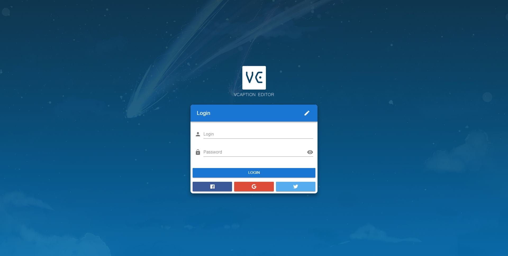
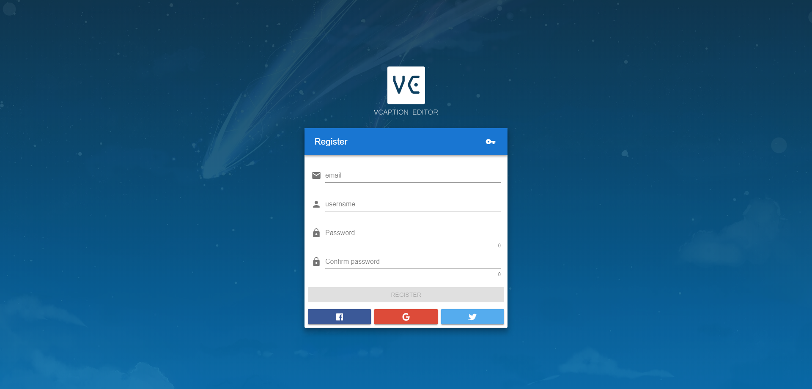
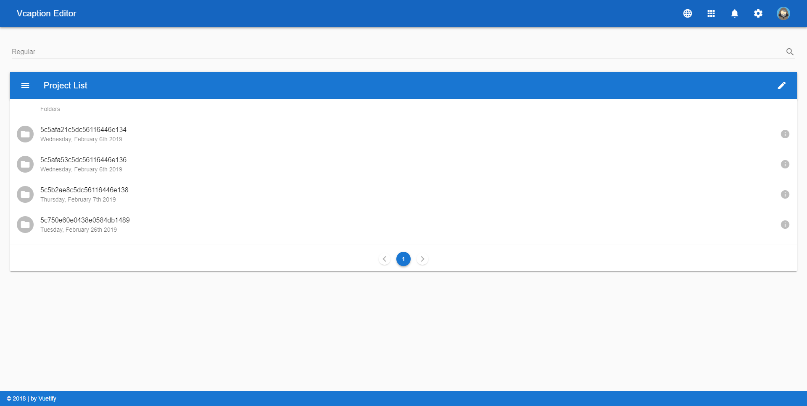
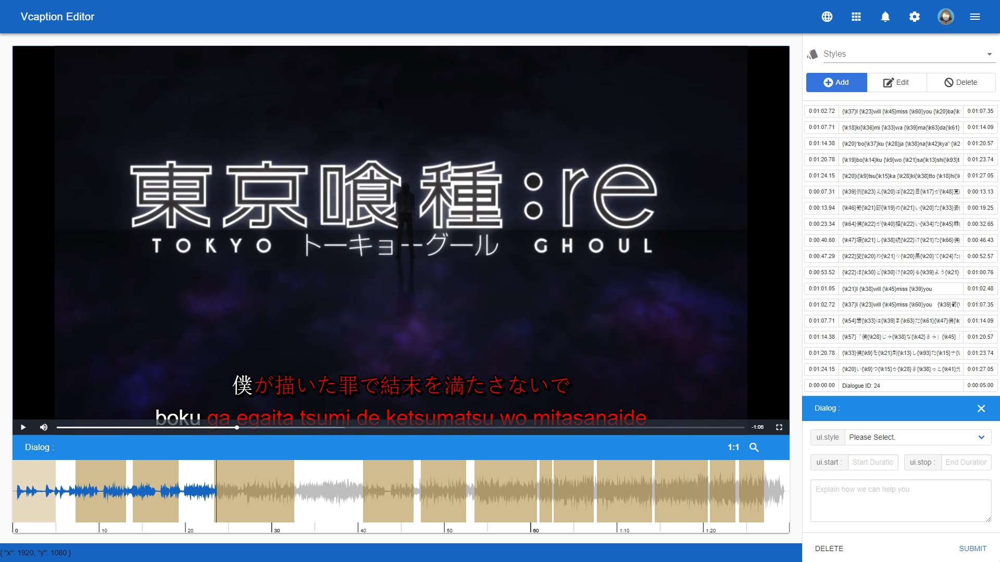
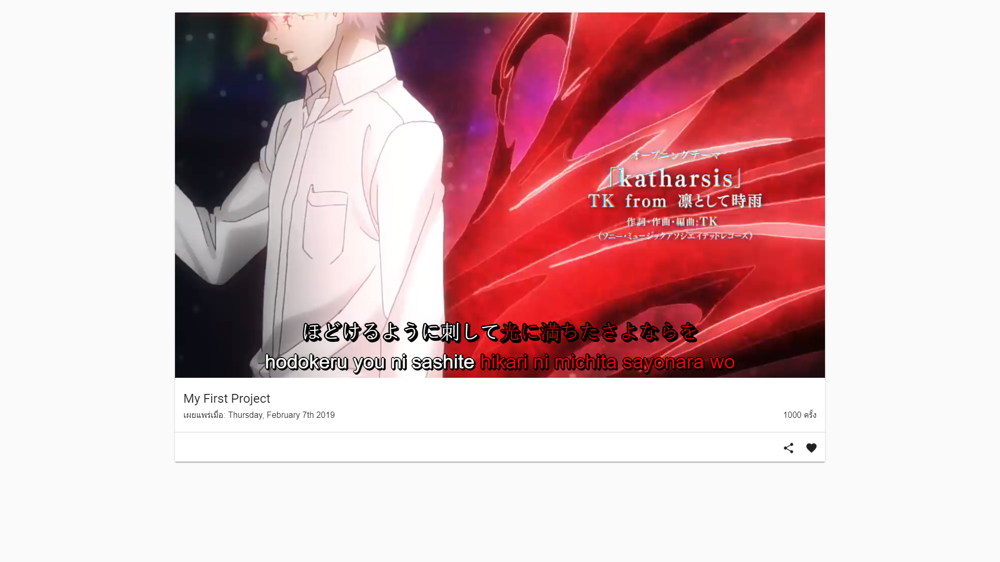
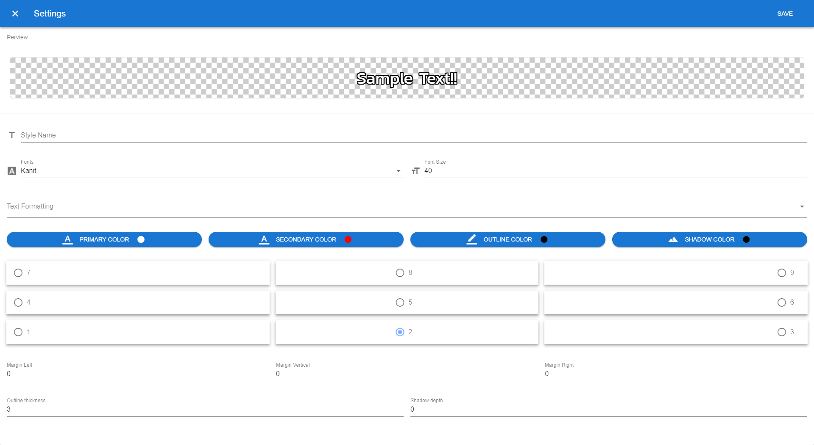
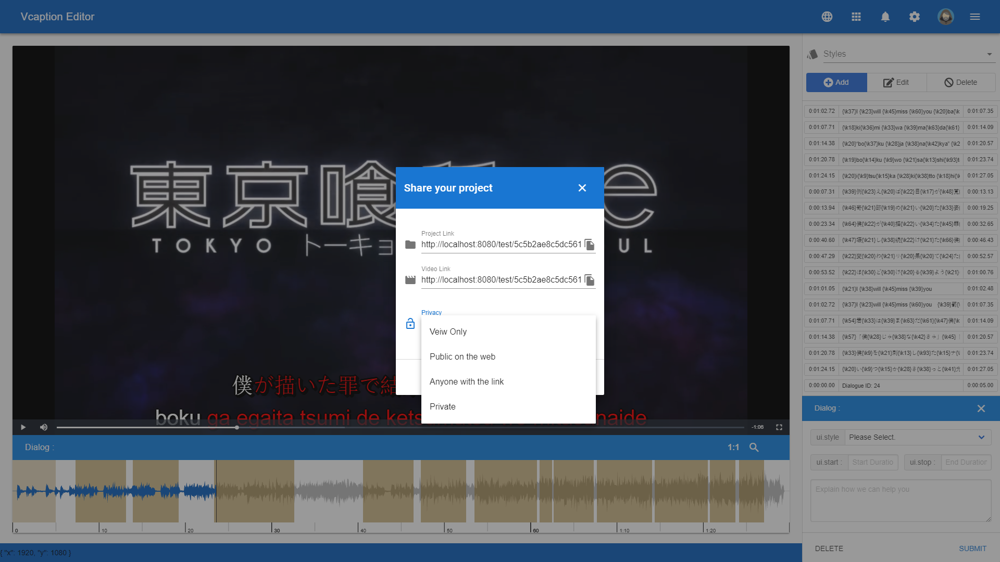

  
  
  
  
  
  
  

### บทคัดย่อ

โครงงานวิจัยระดับปริญญาตรีเรื่อง ระบบจัดการคำบรรยายออนไลน์ (Captioning Editor Online) สาขาวิชาเทคโนโลยีสารสนเทศ คณะวิทยาศาสตร์และเทคโนโลยี มหาวิทยาลัยเทคโนโลยีราชมงคลธัญบุรี จัดทำโดยมีวัตถุประสงค์เพื่อแก้ไขปัญหาการจัดทำ และจัดการคำบรรยายที่ยุ่งยาก ให้ง่ายดายมากยิ่งขึ้น ไม่จำเป็นต้องเปิดโปรแกรมเพื่อเป็นการลดการทรัพยากรคอมพิวเตอร์ และยังช่วยอำนวยความสะดวกในการเช้างานที่สามารถทำได้ทุกที่ทุกเวลา และทำงานร่วมกับผู้อื่นได้ส่งผลให้การดำเนินงานมีความรวดเร็วมากยิ่งขึ้น โดยทางผู้พัฒนาได้จัดทำระบบจัดการคำบรรยายออนไลน์เป็นรูปแบบของ Single page application ช่วยให้ไม่ต้องรอโหลดหน้าเว็บเวลาใช้งานฟังก์ชั่นต่าง ๆ เช่น การสมัครสมาชิก การเข้าสู่ระบบ การสร้างโปรเจ็ค การเลือกรายการโปรเจ็ค การจัดการ Dialogของคำบรรยาย การจัดการ style dialog การแบ่งปันโปรเจ็ค การเผยแพร่ และรับชมวิดีโอผลงานผ่านตัวเล่นวิดีโอของระบบจัดการคำบรรยายออนไลน์ รวมถึงการเก็บยอดจำนวนผู้ชม เป็นต้น นอกจากนี้ระบบยังมีความปลอดภัย และความเป็นส่วนตัวด้วยการกำหนดสิทธิ์การเข้าใช้งานด้วยตัวผู้ใช้ที่เป็นเจ้าของผลงานเพื่อความความปลอดภัย และรักษาความลับของผลงาน

### เนื้อหา
[เล่ม PDF](https://drive.google.com/file/d/1nucZzh1vO2nyqJFYGioYp3RJ-kqQ_c69/view?usp=sharing){:target="_blank"}
  * [บทที่ 1](https://docs.google.com/document/d/1Zo1JGUZi9kVZLidvPzzU1Wtw9tfnbHBfYmofFVOF8OY/edit?usp=sharing){:target="_blank"}
  * [บทที่ 2](https://docs.google.com/document/d/1TI9ciML69zKqNE5p6Gw30ecdM0BuBBnTQHyVBn7-wIo/edit?usp=sharing){:target="_blank"}
  * [บทที่ 3](https://docs.google.com/document/d/1WOT7kChrKKEsHIP02JSquf0vYqXuql3xhiLk-w-ppkY/edit?usp=sharing){:target="_blank"}
  * [บทที่ 4](https://docs.google.com/document/d/1BwjkqccplpKtbCmkeWuD5jQTddhbIfYuvXYHHec-oGk/edit?usp=sharing){:target="_blank"}
  * [บทที่ 5](https://docs.google.com/document/d/12U6wHwmpaO9atevYjBiRtib1ZO6WieXYpRGjju2tMUI/edit?usp=sharing){:target="_blank"}

### Powerpoint

<iframe src="https://onedrive.live.com/embed?cid=F79FF97B59D89EFA&amp;resid=F79FF97B59D89EFA%21424&amp;authkey=AMzksU6sqoql3BE&amp;em=2&amp;wdAr=1.7777777777777777" width="610px" height="367px" frameborder="0">นี่คืองานนำเสนอของ <a target="_blank" href="https://office.com">Microsoft Office</a> แบบฝังตัวที่ทำงานโดย <a target="_blank" href="https://office.com/webapps">Office Online</a></iframe>
