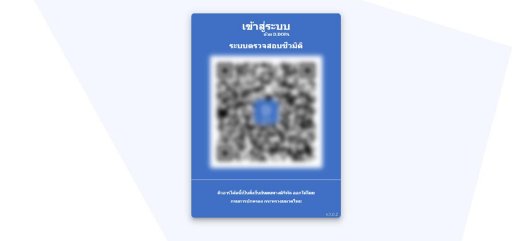
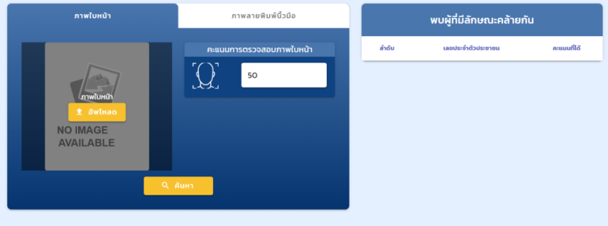
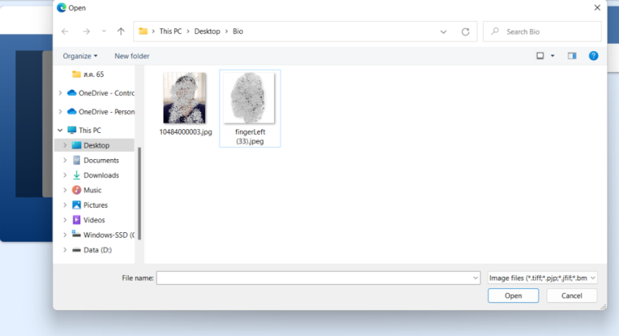
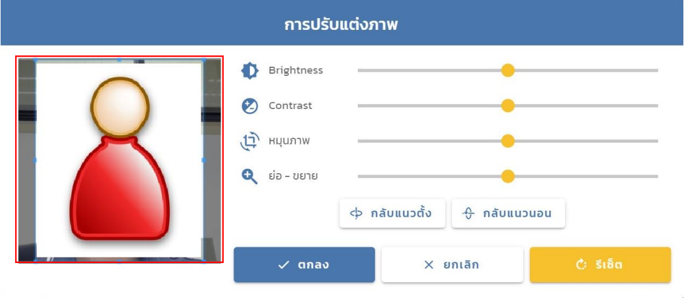
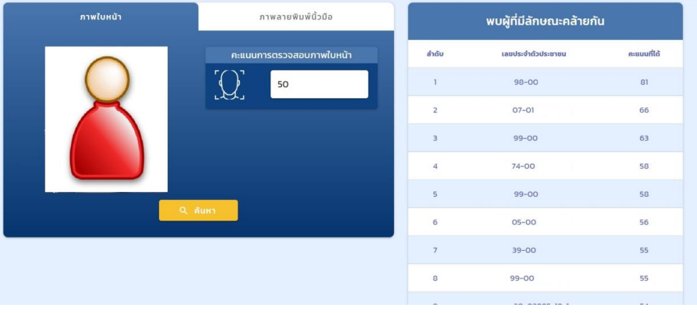
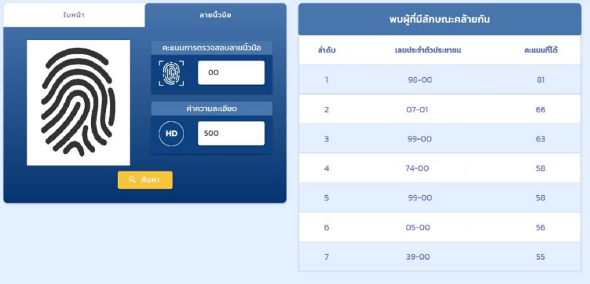

ร่วมพัฒนาในโครงการ Digital ID ให้กับกรมการปกครอง เพื่อขับเคลื่อนโครงการพัฒนาระบบการพิสูจน์และยืนยันตัวตนทางดิจิทัล (DOPA-Digital ID) เพื่อสร้างต้นแบบและนวัตกรรมใหม่ในการพิสูจน์และยืนยันตัวตนทางดิจิทัลของประเทศรองรับการใช้งานบริการภาครัฐ

## ตัวอย่าง

  
  
  
  
  
  
  

