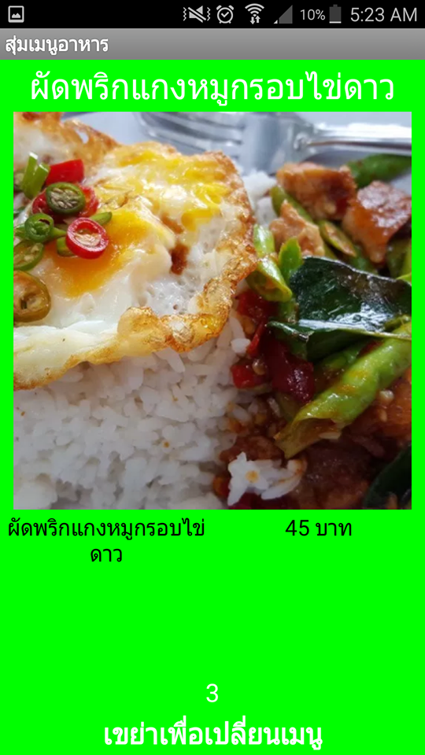

แอพสุ่มรายการอาหารเป็นโปรเจคในช่วงผมศึกษาอยู่ชั้นปีที่ 2 โดย หัวขอคือสร้างแอพลิเคชั่นบนโทรศัพท์มือถืออะไรก็ได้ โดยใช้ [MIT App Invertor](https://appinventor.mit.edu/)

แอพสุ่มรายการอาหารนี้มีการทำงานโดยการรับการเขย่าจากผู้ใช้งานทุกๆ 5 วินาที เพื่อทำการสุ่มเมนูอาหารที่เก็บไว้ในฐานข้อมูล โดยฐานข้อมูลที่เราเลือกใช้เก็บข้อมูลก็คือ [Firebase](https://firebase.google.com/)

โดยในโปรเจคนี้ได้รับประสบการณ์ความรู้เกียวกับการเขียนโค้ดในรูปแบบใหม่ ทำให้ผมได้รู้ว่ามีบริการ Google API หลายตัวที่น่าสนใจ
