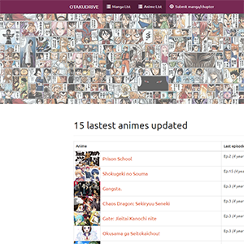
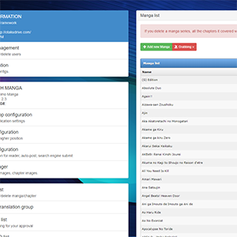
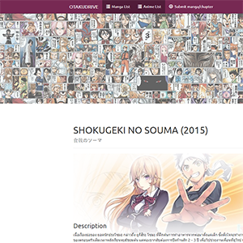
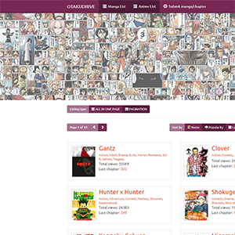
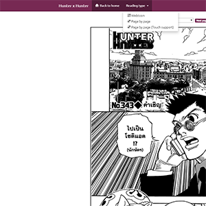

  
  
  
  
  
  

### ฟังชั่นการทำงานต่างๆของตัวระบบ
  ระบบเขียนขึ้นโดยใช้ PHP version 5 และใช้ฐานข้อมูล MySQL เป็นหลักในส่วนของหน้าเว็บผมได้ใช้ JQuery เข้ามาช่วยในการจัดการ Javascript ต่างๆ โดยสามารถแบ่งส่วนของฟังชั่นการทำงานของระบบได้ดังนี้

#### หน้าบ้าน
  * Landing Page
  * Search Autocomplate
  * Content Lists
  * Content Rating
  * Bookmark
  * Notification
  * Login

#### หลังบ้าน
  * SEO Managemant
  * RSS Managemant
  * Role Managemant
  * Content Managemant
  * Template Management

#### Google Analysis

เว็บไซต์ ที่รวมเนื้อหาเกี่ยวกับมังงะ [(漫画)](https://th.wikipedia.org/wiki/%E0%B8%A1%E0%B8%B1%E0%B8%87%E0%B8%87%E0%B8%B0) และอนิเมะ [(アニメ)](https://th.wikipedia.org/wiki/%E0%B8%AD%E0%B8%99%E0%B8%B4%E0%B9%80%E0%B8%A1%E0%B8%B0) ของญี่ปุ่น โดยผมเริ่มผมเริ่มทำเมื่อปี 2014 - 2016 โดยจดชื่อโดเมนว่า [www.otakudrive.com](http://landoflisp.com) แต่ก็น่าเสียดายที่ต้องปิดตัวลงในปี 2016 เนื้อจากปัญหาต่างๆ เนื่องจากตอนนั้นผมเข้ามหาลัยใหม่ๆ เลยไม่มีเวลาลงเนื้อหาของเว้บไซต์

Cotton is a horror-esque text-based adventure game I developed using the functions and macros built from The Wizard's Game in [Conrad Barski's Land of Lisp](http://landoflisp.com/). Slightly more interesting and convoluted! (It is not that scary.)

To give you a flavor of the game, here is an excerpt from one run:

Source: <a href="https://github.com/jogarces/ics-313-text-game"><i class="large github icon "></i>jogarces/ics-313-text-game</a>

