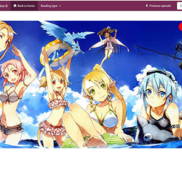
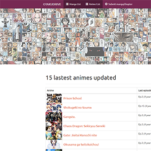
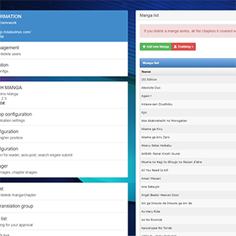
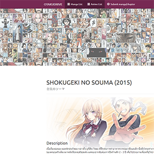
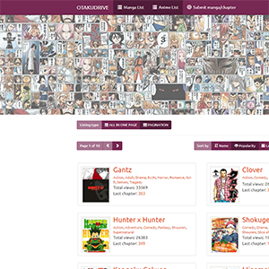
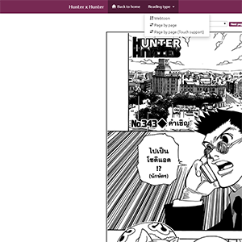

  
  
  
  
  
  

### ฟังชั่นการทำงานต่างๆของตัวระบบ
  ระบบเขียนขึ้นโดยใช้ PHP version 5 และใช้ฐานข้อมูล MySQL เป็นหลักในส่วนของหน้าเว็บผมได้ใช้ JQuery เข้ามาช่วยในการจัดการ Javascript ต่างๆ โดยสามารถแบ่งส่วนของฟังชั่นการทำงานของระบบได้ดังนี้

#### หน้าบ้าน
  * Landing Page
  * Search Autocomplate
  * Content Lists
  * Content Rating
  * Bookmark
  * Notification
  * Login

#### หลังบ้าน
  * SEO Managemant
  * RSS Managemant
  * Role Managemant
  * Content Managemant
  * Template Management
  * Get Picasa Link by CURL

[(PDF)](https://drive.google.com/file/d/16wzYCZ-Neg2b-aPMZSL0ZdmTTDKeSX67/view?usp=sharing) สงวนสิทธิ์ภาพเนื้อหาของตัวโปรเจคในบทที่ 4 ออกทั้งหมด เนื่องจากเป็นไปตามข้อกำหนดของบริษัท

#### Google Analysis

เว็บไซต์ ที่รวบรวมเนื้อหาเกี่ยวกับมังงะ [(漫画)](https://th.wikipedia.org/wiki/%E0%B8%A1%E0%B8%B1%E0%B8%87%E0%B8%87%E0%B8%B0) และอนิเมะ [(アニメ)](https://th.wikipedia.org/wiki/%E0%B8%AD%E0%B8%99%E0%B8%B4%E0%B9%80%E0%B8%A1%E0%B8%B0) ของประเทศญี่ปุ่น โดยผมเริ่มทำโปรเจคเมื่อกลางปีต้นปี 2014 แล้วได้เปิดใช้งานตั้งแต่ปี 2014 - 2016 โดยจดชื่อโดเมนว่า [www.otakudrive.com](http://landoflisp.com) แต่ก็น่าเสียดายที่ต้องปิดตัวลงในปี 2016 เนื้อจากปัญหาต่างๆ เนื่องจากตอนนั้นผมเข้ามหาลัยใหม่ๆ เลยไม่มีเวลาลงเนื้อหาของเว็บไซต์

โดยเว็บไซต์นี้ได้มอบประสบการณ์ความรู้ใหม่ๆนอกเหนือจากการเขียนโปรแกรมให้กับผม เช่น การใช้งานใช้งาน Direct Admin, การใช้ FTP และ SFTP, การสร้าง Sub Domain, การใช้ระบบปฎิบัติการใหม่ที่นอกเหนือไปจาก Window อย่าง ubuntu และอื่นๆอีกมากมาย

Source: <a href="https://github.com/jokerrider007"><i class="large github icon "></i>jokerrider007</a>

