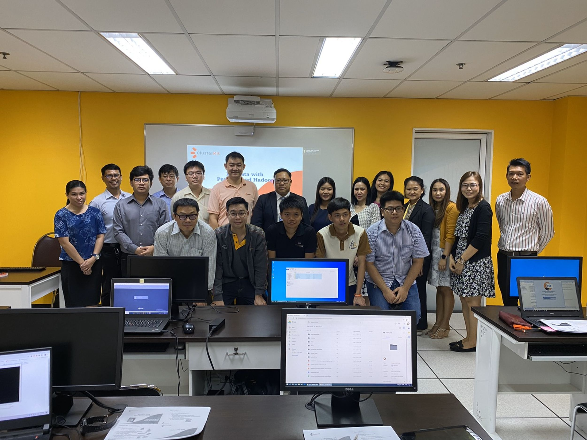

ได้รับการอบรมการใช้งาน Hadoop ขั้นพื้นฐานเริ่มตั้งแต่ ฏิบัติคอนฟิกเครื่องเซิร์ฟเวอร์คลัสเตอร์ให้ทำงานร่วมกัน และศึกษาส่วนประกอบหลัก ๆ ของ Hadoop ไปทีละส่วน ตั้งแต่ส่วนของระบบไฟล์แบบกระจายที่เรียกว่า Hadoop Distributed File System (HDFS) การประมวลผลข้อมูลด้วย MapReduce รวมถึงซอฟต์แวร์แวดล้อมที่มาทำงานบนระบบ MapReduce อย่าง Pig และHive เพื่อใช้จัดการกับข้อมูลในรูปภาษาสคริปต์ และภาษาในลักษณะ SQLตามลำดับ นอกจากนั้นยังได้หัดใช้ Sqoop เพื่อเชื่อมต่อกับซอฟต์แวร์ฐานข้อมูล (DBMS) รวมถึงการติดตั้งและใช้งาน Hue, impala และ spark ผู้เรียนจะได้ศึกษาไปทีละขึ้น รวมถึงจะได้เรียนรู้คำสั่งจำเป็นต่อการดูแลระบบ การอ่านและวิเคราะห์ Log File

  

#### ซอฟต์แวร์ที่ใช้
  * Cloudera Hadoop (CDH6) or Hortonworks Data Platform (HDP3)
  * JDK-1.8
  * CentOS-7 x86_64
  * VirtualBox
  * OpenLandscape Cloud 

#### เนื้อหาหลักสูตร
  * แนะนำ Big Data ในภาพรวม
  * เข้าใจการทำงานและรู้จักองค์ประกอบของ Hadoop
  * แนะนำ Cloudera Hadoop และ Hortonworks Data Platform
  * การปรับแต่งระบบลีนุกซ์เพื่อเตรียมติดตั้ง Hadoop แบบคลัสเตอร์
  * การปรับแต่งไฟล์วอลล์เพื่อความปลอดภัย
  * การกำหนดค่าไฟล์ /etc/hosts
  * ติดตั้งและใช้งาน HDFS (ติดตั้งบนสภาพแวดล้อม 3 เครื่อง ประกอบด้วย 1 Name Node และ 2 Data Node)
  * การใช้งาน HDFS
  * การใช้งาน MapReduce2 (Yarn)
  * การใช้งาน Pig, Hive, Sqoop และ Flume
  * การใช้งาน WebHDFS API
  * การปรับแต่งประสิทธิภาพที่สำคัญสำหรับการใช้งานจริง
  * การออกแบบระบบที่เหมาะสม และกรณีศึกษา

