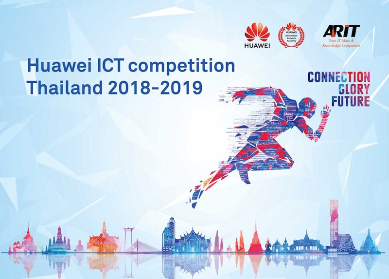
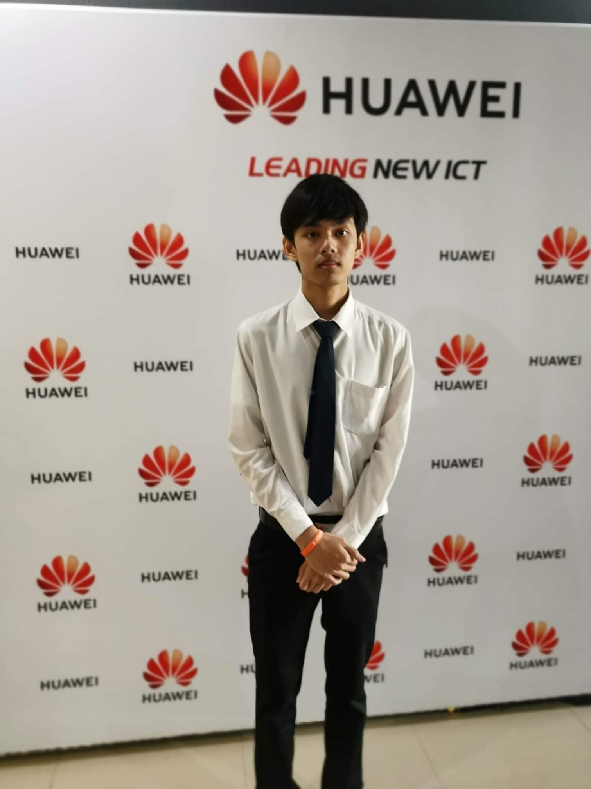

บริษัท หัวเว่ย เทคโนโลยี่  (ประเทศไทย) จำกัด  ร่วมกับบริษัท เออาร์ไอที จำกัด บริษัทชั้นนำเรื่องการฝึกอบรมและศูนย์สอบประกาศนียบัตรมาตรฐานสากล จัดทำโครงการ Huawei ICT Competition Thailand 2018-2019 เพื่อเฟ้นหาตัวแทนเยาวชนไทยไปแข่งขันในระดับเวทีโลก โดยมีวัตถุประสงค์เพื่อสร้างการพบปะการแลกเปลี่ยนประสบการณ์ใหม่ๆ ให้กับผู้เข้าร่วมการแข่งขัน และยังช่วยเพิ่มพูนทักษะด้านเครือข่าย (Network) ให้มีศักยภาพเพิ่มมากยิ่งขึ้น

สำหรับประกาศนียบัตรที่ใช้ในการแข่งขัน คือ HCNA (Huawei Certification Network Associate) เป็นประกาศนียบัตรรับรองความรู้และทักษะที่จำเป็นสำหรับการกำหนดค่าพื้นฐาน และการบำรุงรักษาระบบเครือข่ายขนาดเล็กไปจนถึงขนาดกลาง  ซึ่งหัวข้อการสอบ หลักสูตร HCNA ประกอบด้วย

* ระบบเครือข่ายขั้นพื้นฐาน

* เทคโนโลยีระบบเครือข่าย LAN , WAN , Routing

* การบริหารจัดการระบบเครือข่าย

* ความปลอดภัยของระบบเครือข่าย

* การจัดการ IP Address

* การวิเคราะห์และแก้ไขปัญหาระบบเครือข่ายขนาดเล็กถึงขนาดกลาง

  
  

  

    <h3 class="ui left aligned header no-bottom">Awards</h3>
  

  

    
    
    

      

        

          <b>{{ entry.title }}</b>, {{ entry.awarder }}, {{ entry.date }}
        

        
{{ entry.summary }}

      

      

          
<b>
            
              <a class="ui button" href="../images/rewards/{{entry.image}}">
                Preview
              </a>
            
            <!--  -->
          </b>

        

    

    
    
  

