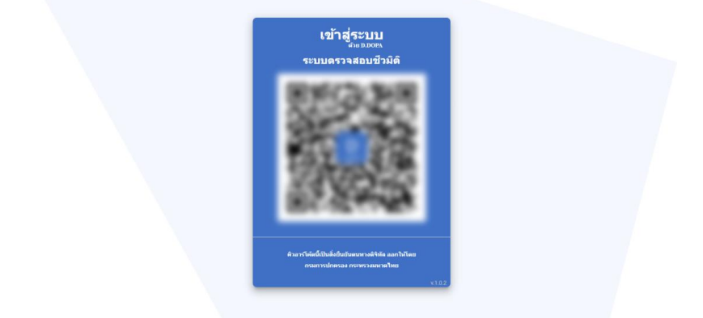
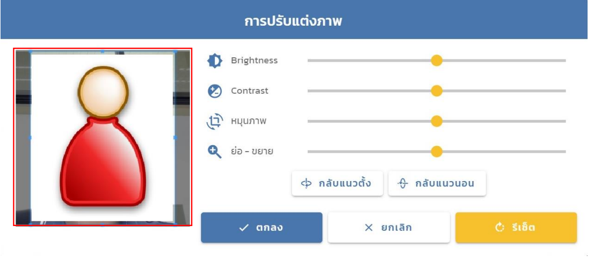
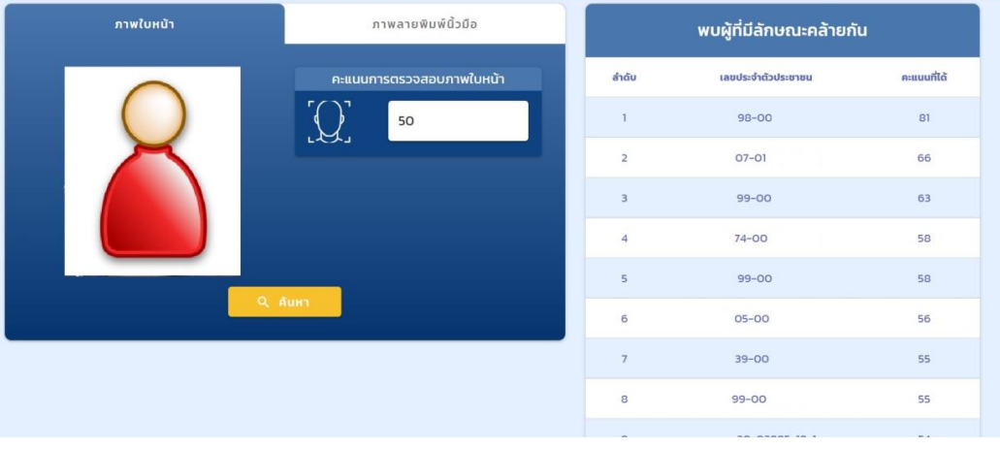
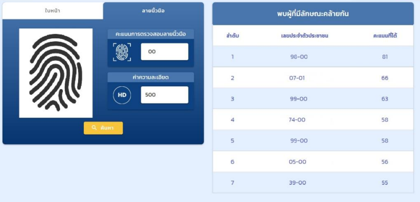

ทำงานที่บริษัท CDG ตำแหน่ง Programmer ในโครงการตรวจสอบอัตลักษณ์ให้กับกรมสอบสวนกลาง (ExBio) เป็นส่วนหนึ่งในการร่วมพัฒนาโปรแกรมที่ใช้ในน่วยงานตำรวจเพื่อทำการค้นหาข้อมูลรูปภาพใบหน้า และรูปภาพลายนิ้วมือที่มีความคล้ายคลึ่งกับหลักฐานที่ส่งเข้ามาในระบบตรวจสอบชีวมิติ

## ตัวอย่าง

  
  
  
  
  
  
  

