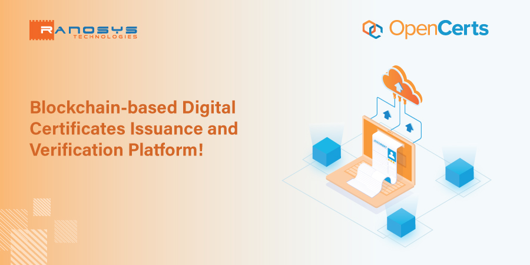
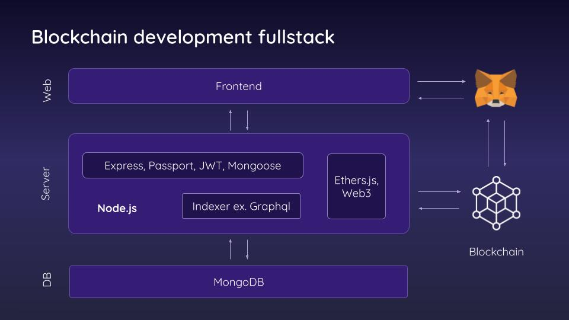
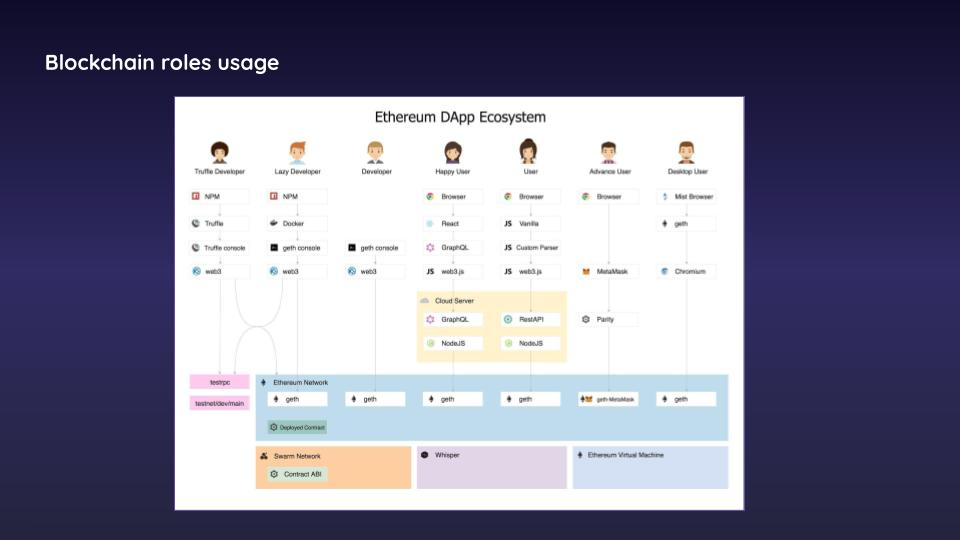
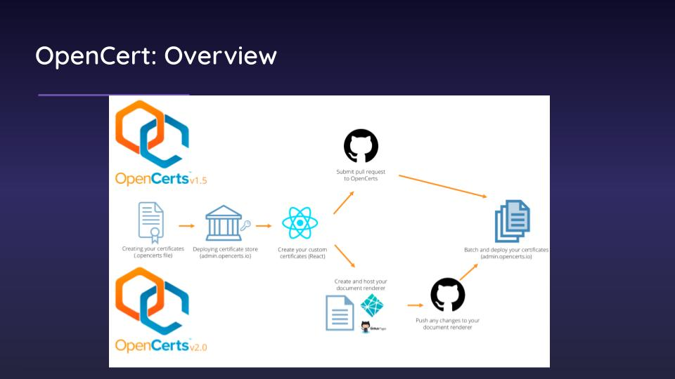
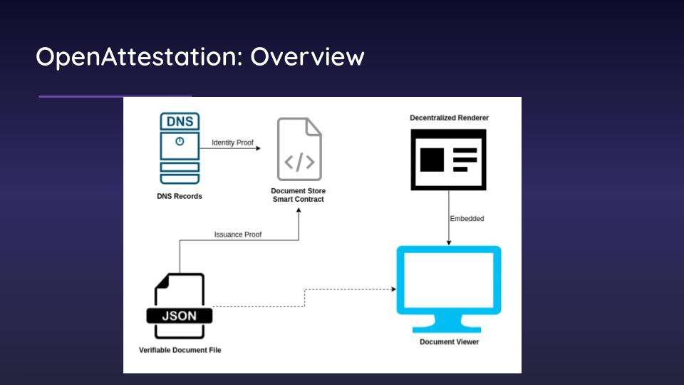

เข้าร่วมการอบรมการพัฒนาเว็บแอพพลิเคชั่นด้วยเทคโนโลยี Blockchain จากการทำ Workshop เว็บแอพพลิเคชั่นการออกใบ Certificate ด้วย OpenCert Concept สำหรับการออกใบประกาศโดยการจำลองการทำงานผ่านเว็บแอพพลิเคชั่นในการออกใบประกาศและเรียกดูข้อมูลบน Etherime Rinkerby Test Network.

## ตัวอย่าง

  
  
  
  

